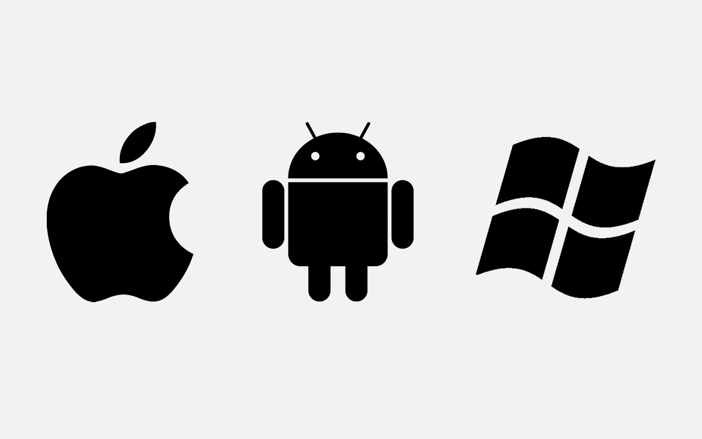

### Hi, I am currently developing web and mobile apps. 👋
I have been continuously studying and thinking about the domains written below to improve my understanding and technical skills.
- React, React native, Javascript, Typescript, HTML, CSS, Java, Kotlin, Python, Android, iOS, Swift, Flutter, Dart, Vue, Angular, Xamarin, C#, C/C++ And..Everything!!!
- My current domain: Web Front End (React) / Cross Platform App (React native) / Android Native App

  

Here is what I'm doing these days:

- 🔭 I’m currently working on web and mobile app projects.
- 🌱 I'm currently thinking about how to efficiently design web and mobile app architectures.
